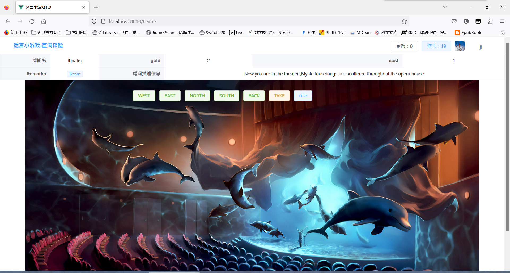
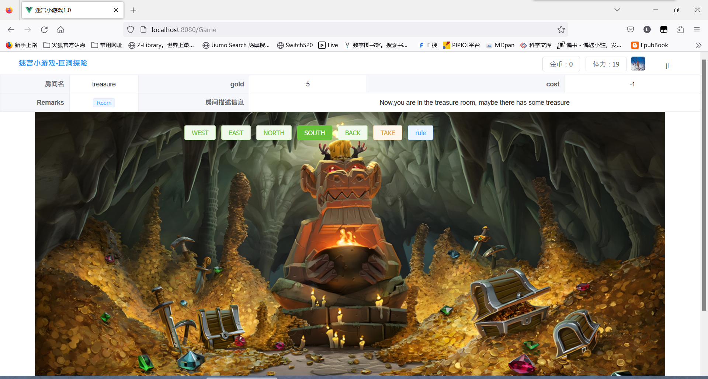

# 软件工程实训2报告

<table>
    <tr>
        <td>课程</td>
        <td>软件工程实践2</td>
    </tr>
    <tr>
        <td>指导老师</td>
        <td>唐祖锴</td>
    </tr>
    <tr>
        <td>班级</td>
        <td>软件2002班</td>
    </tr>
    <tr>
        <td>小组</td> 
        <td>Mars</td>
    </tr>
    <tr>
        <td>组长</td> 
        <td>朱宇森</td>
    </tr>
    <tr>
        <td>组员</td>    
        <td>童宇佳 姜乐 周忠福</td>
    </tr>
</table>

## 一、小组组成及分工
> 本次实践小组由软件2002班的朱宇森、童宇佳、姜乐、周忠福组成，小组成员分工如下：
> - 朱宇森：软件集成打包及ppt制作
> - 童宇佳：基础脚手架vue+springboot的搭建
> - 姜乐：代码优化及测试
> - 周忠福：前端界面的优化和游戏功能的完善及REPORT的编写

## 二、项目简介
- **项目介绍**

  巨洞探险：一个精彩的、充满想像力的复杂游戏，包括要在一个复杂的洞穴系统中找到出路、寻找隐藏的财宝，最终的目的是获得高分。

- **功能扩充需求点**

  1. 可以为游戏增加数据库功能，用于保存游戏状态和用户设置；

  2. 为单机或网络版游戏增加图形化用户界面，用过可以通过图形化界面执行游戏功能；

  3. 在游戏中增加具有传输功能的房间，每当玩家进入这个房间，就会被随机地传输到另一个房间；

  4. 在游戏中实现一个“back”命令，玩家输入该命令后会把玩家带回上一个房间；

  5. 扩展游戏，使得一个房间里可以存放任意数量的物件，每个物件可以有一个描述和一个重量值，玩家进入一个房间后，可以通过“look”命令查看当前房间的信息以及房间内的所有物品信息；

- **开发工具**
  - 前端：Vue.js
  - 后端：SpringBoot
  - 数据库：MySQL
  - 版本控制：Git
  - 项目管理：Maven
  - 开发环境：IntelliJ IDEA

## 三、项目分析
### 1.用例图

### 2. 数据库设计
- **数据字典**

## 四、项目展示
- **部分代码展示**

- **登录界面**

- **注册界面**

- **用户管理**

- **游戏界面**

- **游戏结束**

### 五、项目总结
  本次实践中，我们小组完成了一个基于Vue+SpringBoot的巨洞探险游戏，实现了游戏的基本功能并完成了扩充。
  在实践过程中，我们小组成员分工明确，相互配合，较为顺利地完成了本次项目的开发。在项目开发过程中，
  我们也遇到了很多问题，但是我们通过查阅资料、相互讨论等方式，最终解决了问题，完成了项目的开发。
  通过本次实践， 我们小组成员学习到了很多软件工程相关的知识，通过实践理解、掌握并运用软件开的的思路、方法和技术，
  也训练了我们团队交流合作了能力，提高了我们动手解决问题的能力，这对我们今后的学习和工作都有很大的帮助。